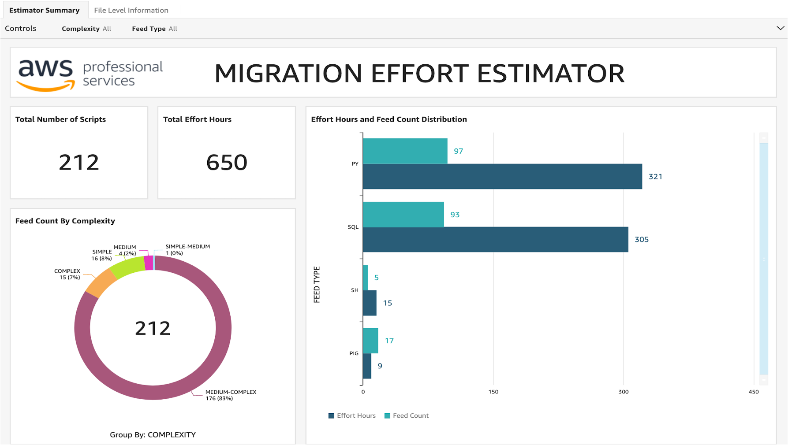
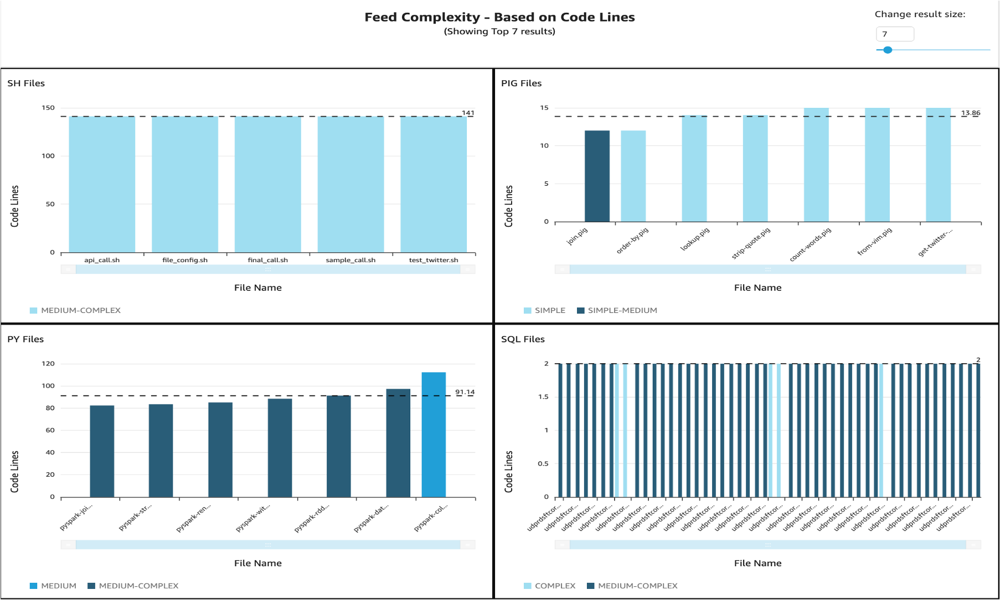

# Migration Effort Estimator User Guide

## Overview:

In migration projects a significant time is spent in analysing and predicting how to accurately estimate the project migration efforts. 

The framework developed helps to simplifying this problem by:
Understanding Projects Complexities(simple, simple-medium, medium, meedium-complex, complex) - both file level complexities as well as summary level
Map complexitird to efforts required to complete the project.

It takes client's scripts to be migrated as input and gives output in form of file level complexities info, estimation summary info and visualisations which helps business to estimate the efforts required to project efficiently.


## Visual 1: Overall project complexity



## Visual 2: Estimator Dashboard


## Visual 3: Estimator Dashboard



## For Detailed Deployment Instructions and Runbook

     Folder info
       - `Input Folder` : It has appconfig.json, estimator_template.xlsx. You will be placing compressed migration scripts folder here.
       - `Outputs folder` : After you run the script, it will have all your migration files arranged according to folders
       - `Excel folder` :  It will have have two file generated one each for file level and summary level info
       - `Log Folder` : Will have execution logs
    
      1.	Bundle your scripts to be migrated in form of a zip file and place it in input folder of the framework
      2.	Use appconfig.json file inside input folder to define keywords to be considered for calculating complexity of the file. 
      Note: There is already set of keywords defined. You can add or delete according to your use case.
      3.    Use config sheet of estimator_template.xlsx inside input folder to define effort hours for each complexity
      Note: There is already effort hours defined. Please edit according to your use case.
      4. Install Requirements
      Run 
      ```
      pip3 install -r requirements.txt
      ```
      5. Run the estimator.py with arguments
      ```
      python3 estimator.py --input 'input/<your_zip_file_name>' --output 'outputs/' --config 'input/appconfig.json' [--bucket '<S3_bucket>'] 
      ```
      Note: input, output and config are required arguments; bucket is an optional argument, if mentioned will upload your Excels generated to mentioned S3 bucket.

### We have completed all the steps here to run Validation end to end. For any issues or concerns you can get in touch with team.
