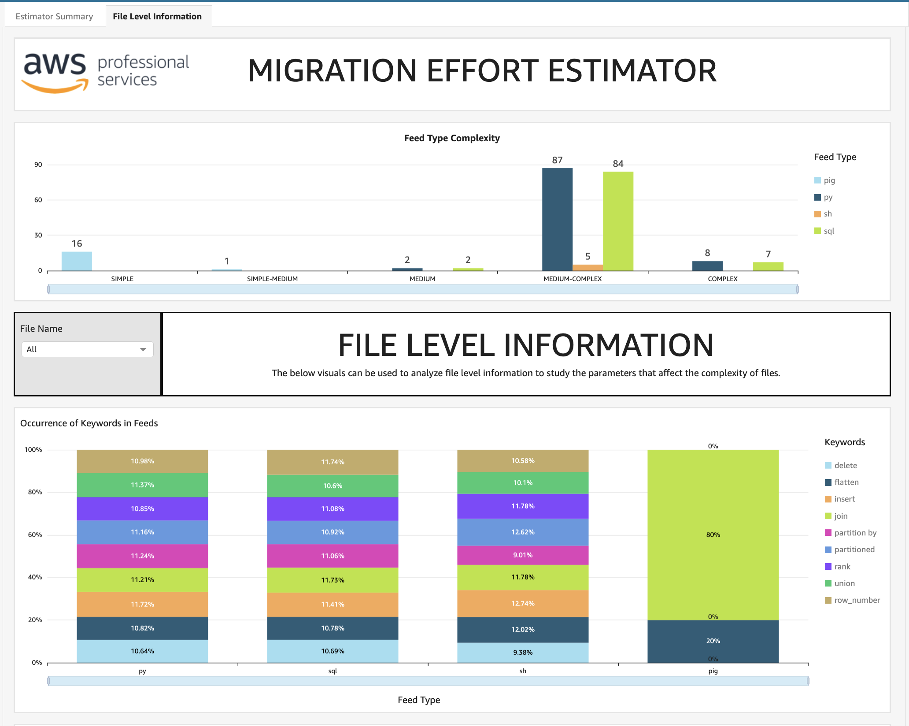

# Migration Effort Estimator User Guide

## Overview:

In migration projects a significant time is spent in analysing and predicting how to accurately estimate the project migration efforts. 

The  framework developed helps to simplifying this problem by:
- Understanding Projects Complexities(simple, simple-medium, medium, meedium-complex, complex) - both file level complexities as well as summary level.
- Map complexitird to efforts required to complete the project.

It takes client's scripts to be migrated as input and gives output in form of file level complexities info, estimation summary info and visualisations which helps business to estimate the efforts required to project efficiently.


## Visual 1: Overall project complexity


## Visual 2: Estimator Dashboard



## Visual 3: Estimator Dashboard


## For Detailed Deployment Instructions and Runbook

<b>Folder Level info</b>
       
1. `Input Folder` : It has appconfig.json, estimator_template.xlsx. You will be placing compressed migration scripts folder here.
2. `Outputs folder` : Once the script is run, it will have all migration files arranged according to Script type.
3. `Excel folder` :  It will have have two file generated one each for file level and summary level info
4. `Log Folder` : Will have execution logs
    
<b>Step by Step instruction to run the code </b>
1. Bundle your scripts to be migrated in form of a zip file and place it in `input` folder of the framework
2. Use `appconfig.json` file inside input folder to define keywords to be considered for calculating complexity of the file. 
</br>Note: There is already set of keywords defined. You can add or delete according to your use case.
3. Use config sheet of `estimator_template.xlsx` inside input folder to define effort hours for each complexity
</br>Note: There is already effort hours defined. Please edit according to your use case.
4. Install Requirements
Run 
      ```
      pip3 install -r requirements.txt
      ```
5. Run the estimator.py with arguments
      ```
      python3 estimator.py --input 'input/<your_zip_file_name>' --output 'outputs/' --config 'input/appconfig.json' [--bucket '<S3_bucket>'] [--topic '<topic ARN>']
      ```
      Note: Arguments `input`, `output` and `config` are required; `bucket` and `topic` are optional arguments, if mentioned will upload your Excels generated to mentioned S3 bucket and send notification to Topic mentioned. 

## Optional QuickSight Setup

# Using Amazon QuickSight CLI
You can create a Amazon QuickSight Dashboard using the `analysis_definition.json` file. </br></br>
       1. Create the datasets from S3 in QuickSight for both Summary file and File level information.</br>
       2. Edit the `analysis_definition.json` file by replacing variables: </br>
              - `$AwsAccountId`: Your AWS accountID ,</br>
              - `$region`: Region where QuickSight Analysis has to be created (like 'us-east-1'),</br>
              - `$namespace`: Namespace where QuickSight User is present (default is 'default'),</br>
              - `$username` : Username of QuickSight User which needs permission to the analysis,</br>
              - `$SummaryDatasetID`: DatasetID of summary file created above,</br>
              - `$FileLevelInfoDatasetID`: DatasetID of file level information created above. </br></br>
       3. Create analysis using the below CLI command:</br>
       ```
       aws quicksight create-analysis --generate-cli-skeleton > analysis_definition.json
       ```
       </br></br>
       4. Make required changes to analysis based on custom requirements and then publish it as dashboard.</br></br>

# Using CFN Template

The CloudFormation template `CFN_Template_QS.json` creates a QuickSight analysis based on two datasets: "summary_file" and "file_level_info". Here is a breakdown of the key components:

- `S3BucketName`: The name of the S3 bucket where the data is stored.
- `AthenaWorkgroup`: The Athena workgroup to be used.
- `UserArn`: The ARN of the QuickSight user who would own the analysis.

Additional resources created by the template are as follows:
- `GlueRole`: An IAM role with the necessary permissions for Glue to access the S3 bucket.
- `GlueCrawlerSummary` and `GlueCrawlerScript`: Glue crawlers to crawl the data in the S3 bucket and create the corresponding Athena tables.
- `CrawlerWaiter` and `CrawlerWaiterFunction`: A custom resource and a Lambda function to wait for the completion of the Glue crawlers.
- `LambdaExecutionRole`: An IAM role with the necessary permissions for the Lambda function.
- `QuickSightDataSource`: A QuickSight data source for the Athena data.
- `QuickSightDataSetSummary` and `QuickSightDataSetScript`: QuickSight datasets based on the Athena tables created by the Glue crawlers.
- `QuickSightAnalysis`: The QuickSight analysis that uses the created datasets.

The template sets up the necessary infrastructure to utilize the ingested data in the S3 bucket, create Athena tables using Glue crawlers, and then create QuickSight datasets and an analysis based on these tables.

      
## Security

See [CONTRIBUTING](CONTRIBUTING.md#security-issue-notifications) for more information.

## License

This project is licensed under the MIT-0 License.
